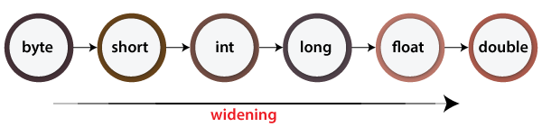

# Class 1

## Introduction To Functional Programming With Java

### What's Functional Programming?

**Functional programming** is a programming paradigm in which we try to
bind everything in pure mathematical functions style. It is a declarative
type of programming style. Its main focus is on “what to solve” in contrast
to an imperative style where the main focus is “how to solve”. It uses expressions
instead of statements. An expression is evaluated to produce a value whereas a
statement is executed to assign variables.

source [Functional Programming Paradigm - geeksforgeeks](https://www.geeksforgeeks.org/functional-programming-paradigm/)

## Why Functional Programming?

**Functional programming** is all about treating computation as the evaluation of mathematical functions and avoiding
changing-state and mutable data. So, why should Java developers consider this paradigm?

- **Concise and Expressive Code**: Functional programming promotes shorter, more concise code, making it easier to
  understand and maintain. This can lead to increased productivity and fewer bugs.
- **Immutable Data**: It encourages immutability, which means once data is created, it cannot be changed. This can
  improve code reliability and make it easier to reason about.
- **Parallel and Concurrent Programming**: Functional programming is an excellent fit for parallel and concurrent
  programming, where tasks are executed simultaneously, and shared data is managed safely.
- **Higher-Order Functions**: Java’s support for higher-order functions is quite powerful. It allows you to pass functions
  as arguments and return functions from other functions.
- **Declarative Approach**: You describe what your code should achieve, rather than listing the steps to achieve it.
  This leads to more expressive and less error-prone code.
- **Java’s Lambda Expressions**: With the introduction of lambda expressions in Java 8, functional programming in Java
  became much more practical and accessible. You can define and use functions more concisely than ever before.

source: [Java Functional Programming Essentials - Medium](https://medium.com/@furkanalniak/java-functional-programming-essentials-efb9aef1290e)

## Basic Concepts

1. Higher-Order Functions

**Higher-order functions are capable of receiving functions as arguments and returning a function as a result.**

source: [Functional Programming in Java - Baeldung](https://www.baeldung.com/java-functional-programming)

### Higher Order function Example

```java
import java.util.function.Function;

public class Main {
    public static void main(String[] args) {
        Function<Integer, Integer> square = x -> x * x;
        Function<Integer, Integer> doubles = x -> x * 2;

        //Function Compositions
        Function<Integer, Integer> doubleSquare = square.compose(doubles);
        System.out.println(doubleSquare.apply(5));
        }
}
```

2. Data Inmutability

In functional programming, we can’t modify a variable after it’s been initialized. We can create new variables – but we 
can’t modify existing variables, and this really helps to maintain state throughout the runtime of a program. Once we 
create a variable and set its value, we can have full confidence knowing that the value of that variable will never change.  

source [Functional Programming Paradigm - geeksforgeeks](https://www.geeksforgeeks.org/functional-programming-paradigm/)

Variables Inmutability examples

```java
import java.util.List;

public class Main {
    public static void main(String[] args) {
        List<Integer> numbers = List.of(1,2,3,4,5);

        // Map Operation to create a new list with square values of each number

        List<Integer> squares = numbers.stream()
                .map(x -> x * x)
                .toList();
        
        System.out.println(squares);
        
        }
}
```

3. Pure Functions

A function is called **pure function** if it always returns the same result for same argument values and it has no side 
effects like modifying an argument (or global variable) or outputting something. The only result of calling a pure 
function is the return value.


Pure Function Example

```java
import java.util.List;

public class Main {
    public static void main(String[] args) {

        int result = sum(3,3);
        System.out.println(result);

        }

    public static int sum(int a, int b){
        return a + b;
    }

}
```

## Summary

- Functional programming promotes the composition of functions, data immutability, and pure functions. 
- These concepts help in writing more concise, predictable, and easily understandable code. 
- Java offers support for functional programming through features such as lambdas, streams, and higher-order functions.

# Map, Reduce and Filter

## Map

The map is a well-known functional programming concept that is incorporated into Java 8. Map is a function defined in 
java.util.stream.Streams class, which is used to transform each element of the stream by applying a function to each 
element. Because of this property, you can use a map() in Java 8 to transform a Collection, List, Set, or Map.

source: [Java 8 Stream map() function Example with Explanation](https://www.java67.com/2015/01/java-8-map-function-examples.html)

```java
import java.util.ArrayList;
import java.util.List;
import java.util.function.Function;

public class Main {

    public static <T,R> List<R> map(List<T> list, Function<T,R> function){
        List<R> result = new ArrayList<>();
        for(T element: list){
            result.add(function.apply(element));
        }
        return result;
    }

    public static void main(String[] args) {

    List<Integer> numbers = List.of(1,2,3,4,5);

    // Duplicate numbers
    List<Integer> duplicates = map(numbers, n -> n * 2);
        System.out.println("Duplicates: " + duplicates);

    List<Integer> negatives = map(numbers, n -> -n);
        System.out.println("Negatives: "+ negatives);
    }
}
```

## Reduce

The reduce method, also known as fold in functional programming lingo, accumulates the elements of the stream with a 
BinaryOperator<T> and reduces them to a single value:

```
T reduce(T initialValue, BinaryOperator<T> accumulator)
```

source: [Functional Programming With Java: map, filter, reduce](https://belief-driven-design.com/functional-programm-with-java-map-filter-reduce-77e479bd73e/)

## Guide to Stream.reduce()

Reduction stream operations allow us to produce one single result from a sequence of elements, by repeatedly applying a 
combining operation to the elements in the sequence.

### The Key Concepts: Identity, Accumulator and Combiner

Before we look deeper into using the Stream.reduce() operation, let’s break down the operation’s participant elements 
into separate blocks. That way, we’ll understand more easily the role that each one plays.

- **Identity** – an element that is the initial value of the reduction operation and the default result if the stream is empty.
- **Accumulator** – a function that takes two parameters: a partial result of the reduction operation and the next element of the stream.
- **Combiner** – a function used to combine the partial result of the reduction operation when the reduction is parallelized or when there’s a mismatch between the types of the accumulator arguments and the types of the accumulator implementation.


source: [Guide to Stream.reduce()](https://www.baeldung.com/java-stream-reduce)

## Functional Programming with Java - Reducing

In functional programming, reducing is a technique to reduce a stream of values to a single result by apply a function 
on all the values. Java provides reduce() function in a Stream class from Java 8 onwards. A stream has inbuilt reducing 
methods like sum(), average(), count() as well which works on all elements of the stream and returns the single result.

source: [Functional Programming with Java - Reducing](https://www.tutorialspoint.com/functional_programming_with_java/functional_programming_with_java_reducing.htm)

## Stream.reduce() in Java with examples

Many times, we need to perform operations where a stream reduces to single resultant value, for example, maximum, minimum, 
sum, product, etc. Reducing is the repeated process of combining all elements.

reduce operation applies a binary operator to each element in the stream where the first argument to the operator is 
the return value of the previous application and second argument is the current stream element.

### Syntax:

```java
T reduce(T identity, BinaryOperartor<T> accumulator);

where, identity is initial value
of type T and accumulator is a
function for combining two values.
```

sum(), max(), count() etc. are some examples of reduce operations. reduce() explicitly asks you to specify how to reduce the data that
made it through stream.

### Example 1:

```java
import java.util.Arrays;
import java.util.List;
import java.util.Optional;

public class Reducev1 {
    public static void main(String[] args) {
        // creating a list of Strings
        List<String> words = Arrays.asList("GFG", "Geeks", "for",
                "GeeksQuiz", "GeeksforGeeks");


        // The lambda expression passed to
        // reduce() method takes two Strings
        // and returns the longer String.
        // The result of the reduce() method is
        // an Optional because the list on which
        // reduce() is called may be empty.
        Optional<String> longestString = words.stream()
                .reduce((word1, word2)
                        -> word1.length() > word2.length()
                        ? word1 : word2);

        // Displaying the longest String
        longestString.ifPresent(System.out::println);

    }
}
```

### Example 2:

```java
import java.util.List;
import java.util.function.BinaryOperator;

public class Reducev2 {

    public static <T> T reduce(List<T> list, T identity, BinaryOperator<T> operator){
        T result = identity;
        for(T element: list){
            result = operator.apply(result, element);
        }
        return result;
    }
    public static void main(String[] args) {
        List<Integer> numbers = List.of(1,2,3,4,5);

        //sum all numbers
        int sum = reduce(numbers,0,(a,b)-> a + b);
        System.out.println("Sum: "+sum);

        // multiply all numbers
        int product = reduce(numbers,1,(a,b)-> a * b);
        System.out.println("Product: "+product);
    }
}

```

# Filter

## How to use Stream.filter method in Java 8? Example Tutorial

The **filter()** method as its name suggests is used to perform filtering 
based upon some boolean conditions.  The condition is applied to each 
element of Stream and those who pass the condition moves to the next stage 
and those who don't get filtered out.

For example,  if you have a stream of integral numbers that contains both 
even and odd numbers then by using the filter method, you can create another 
stream of even numbers or odd numbers by filtering out others.

Though the filter() method is a little bit counter-intuitive, I mean, in order 
to create a stream of even numbers you call filter( i -> i % 2 == 0) which means 
you do filter(isEven()) but, you are actually filtering out odd numbers to create 
a new stream of even numbers, but that's how it works.

I think select() would have been a positive and proper name for this operation, but, 
we don't have any control over that can't change that now.

The key benefit of using the filter() method is lazy evaluation i.e. no data comparison 
is performed unless you call a terminal operation on stream like findFirst() or forEach().

Source: [How to use Stream.filter method in Java 8? Example Tutorial](https://www.java67.com/2016/08/java-8-stream-filter-method-example.html)

## How to Stream.filter method works in Java 8

In order to learn how to use the **filter()** method in Java 8, it's important that you also
know how it works, at least at a high level. Let's see an example of a **filter() method** to
understand the lazy evaluation it does.

Suppose we have a list of integer numbers and we want to find the first number which is
divisible by both 2 and 3, let's see how to solve this problem in Java 8.

```java
import java.util.Arrays;
import java.util.List;

public class filterv1 {
    public static void main(String[] args) {
        List<Integer> listOfNumbers = Arrays.asList(1, 2, 3, 4, 5, 6, 12, 18);

        Integer lcm = listOfNumbers.stream()
                .filter(i -> i % 2 == 0)
                .filter(i -> i % 3 == 0)
                .findFirst().get();

        System.out.println(lcm);
    }
}

```

This code is returning the first number which is divisible by both 2 and 3.

## How to use filter() method in Java 8

Here is a sample Java program to demonstrate how to use the filter() method 
of Stream class to filter elements from a List or Stream, based upon some conditions,
specified by the Predicate functional interface of Java 8.


```java
import java.util.ArrayList;
import java.util.Arrays;
import java.util.List;

public class filterv2 {

    public static void main(String[] args) {
        List<String> versions = new ArrayList<>();

        versions.add("Lollipop");
        versions.add("KitKat");
        versions.add("Jelly Bean");
        versions.add("Ice Cream Sandwidth");
        versions.add("Honeycomb");
        versions.add("Gingerbread");

        // Using one filter()
        // print all versions whose length is greater than 10 character
        System.out.println("All versions whose length greater than 10");

        versions.stream() .filter(s -> s.length() > 10)
                .forEach(System.out::println);

        System.out.println("first element which has letter 'e' ");
        String first = versions.stream()
                .filter(s -> s.contains("e"))
                .findFirst().get(); System.out.println(first);

                // Using multiple filter
        System.out.println("Element whose length is > 5 and startswith G");
        versions.stream()
                .filter(s -> s.length() > 8)
                .filter(s -> s.startsWith("G"))
                .forEach(System.out::println);

        // another example of filter() method in Java 8
        List<Integer> listOfNumbers = Arrays.asList(1, 2, 3, 4, 5, 6, 12, 18);
        Integer lcm = listOfNumbers.stream()
                .filter(i -> i % 2 == 0)
                .filter(i -> i % 3 == 0)
                .findFirst().get();
        System.out.println("first number divisible by 2 and 3 in the list is : " + lcm);


    }
}

```

### Filter Function

```java
import java.util.ArrayList;
import java.util.List;
import java.util.function.Predicate;

public class filterv3 {

    public static <T> List<T> filter(List<T> list, Predicate<T> predicate){
        List<T> result = new ArrayList<>();
        for(T element: list){
            if(predicate.test(element)){
                result.add(element);
            }
        }
        return result;
    }

    public static void main(String[] args) {

        List<Integer> numbers = List.of(1,2,3,4,5,6,7,8,9,10);

        //Filter square numbers
        List<Integer> pairs = filter(numbers, n-> n % 2 == 0);
        System.out.println("pair numbers: "+pairs);

        //Filter numbers greater than 5
        List<Integer> greaterThan5 = filter(numbers, n -> n > 5);
        System.out.println("Numbers greater than 5: "+ greaterThan5);

        // Filter numbers smaller or equal to 3
        List<Integer> smallerOrEqualTo3 = filter(numbers, n -> n <= 3);
    System.out.println("Numbers smaller or equal to 3: "+ smallerOrEqualTo3);
    
    }
}

```


----

# Practice Excercise with Answers


In this exercise, we will practice function composition using different operations on a list of numbers.

1. Implement a function called "double" that takes an integer as an argument and returns twice that number.

2. Implement a function called "isEven" that takes an integer as an argument and returns true if the number is even, or false otherwise.

3. Use the functions "filter" and "map" to create a new function called "doubleAndFilterEvens" that takes a list of numbers, doubles each number, and filters only the even numbers.

4. Test your "doubleAndFilterEvens" function with different lists of numbers to ensure it works correctly.

```java
import java.util.List;
import java.util.function.Function;
import java.util.function.Predicate;

public class practiceExercises {

    public static int duplicate(int number){
        return number * 2;
    }

    public static boolean isPair(int number){
        return number % 2 == 0;
    }


    public static List<Integer> duplicateAndFilterPairs(List<Integer> numbers){
        Function<Integer, Integer> duplicateFunction = practiceExercises::duplicate;
        Predicate<Integer> isPairFunction = practiceExercises::isPair;

        return numbers.stream()
                .map(duplicateFunction)
                .filter(isPairFunction)
                .toList();

    }


    public static void main(String[] args) {


        List<Integer> numbers = List.of(1,2,3,4,5,6,7,8,9,10);
        System.out.println("Original List: "+ numbers);

        List<Integer> results = duplicateAndFilterPairs(numbers);
        System.out.println("Results: "+ results);


    }
}
```


---

# Generic Class in Java

Java Generics was introduced to deal with type-safe objects. It makes the code stable.Java Generics methods and classes, 
enables programmer with a single method declaration, a set of related methods, a set of related types. Generics also provide 
compile-time type safety which allows programmers to catch invalid types at compile time. Generic means parameterized types. 
Using generics, the idea is to allow any data type to be it Integer, String, or any user-defined Datatype and it is possible 
to create classes that work with different data types.

A Generic class simply means that the items or functions in that class can be generalized with the parameter(example T) 
to specify that we can add any type as a parameter in place of T like Integer, Character, String, Double or any other 
user-defined type.

source: [Generic Class in Java](https://www.geeksforgeeks.org/generic-class-in-java/)

## Example:

```java
class Solution<T>
{
   T data;
   public static T getData(){
       return data;
   }
}
```

# Java Genric Methods

Generic Java method takes a parameter and returns some value after performing a task. It is exactly like a normal function, 
however, a generic method has type parameters that are cited by actual type. This allows the generic method to be used in a 
more general way. The compiler takes care of the type of safety which enables programmers to code easily since they do not 
have to perform long, individual type castings.

````java
  public class GenericMethodTest {
  // generic method printArray
  public static < E > void printArray( E[] inputArray ) {
    // Display array elements
    for(E element : inputArray) {
      System.out.printf("%s ", element);
    }
    System.out.println();
  }

  public static void main(String args[]) {
    // Create arrays of Integer, Double and Character
    Integer[] intArray = { 1, 2, 3, 4, 5 };
    Double[] doubleArray = { 1.1, 2.2, 3.3, 4.4 };
    Character[] charArray = { 'H', 'E', 'L', 'L', 'O' };

    System.out.println("Array integerArray contains:");
    printArray(intArray);   // pass an Integer array

    System.out.println("\nArray doubleArray contains:");
    printArray(doubleArray);   // pass a Double array

    System.out.println("\nArray characterArray contains:");
    printArray(charArray);   // pass a Character array
  }
}
````

source: [Java - Generics](https://www.tutorialspoint.com/java/java_generics.htm)

---

# Bounded Types with Generics in Java

There may be times when you want to restrict the types that can be used as type arguments in a parameterized type. For example, a method that operates on numbers might only want to accept instances of Numbers or their subclasses. This is what bounded type parameters are for.

- Sometimes we don’t want the whole class to be parameterized. In that case, we can create a Java generics method. Since the constructor is a special kind of method, we can use generics type in constructors too.
- Suppose we want to restrict the type of objects that can be used in the parameterized type. For example, in a method that compares two objects and we want to make sure that the accepted objects are Comparables.
- The invocation of these methods is similar to the unbounded method except that if we will try to use any class that is not Comparable, it will throw compile time error.

### How to Declare a Bounded Type Parameter in Java?

1. List the type parameter’s name,
2. Along with the extends keyword
3. And by its upper bound. (which in the below example c is A.)

### Syntax:

```java
  <T extends superClassName>
```

Source: [Bounded Types with Generics in Java](https://www.geeksforgeeks.org/bounded-types-generics-java/)

# Implicitly Typecasting in Java

The process of converting one type of object and variable into another type is referred to as Typecasting. When the 
conversion automatically performs by the compiler without the programmer's interference, it is called implicit type 
casting or widening casting.

In implicit typecasting, the conversion involves a smaller data type to the larger type size. For example, the byte 
datatype implicitly typecast into short, char, int, long, float, and double. The process of converting the lower data 
type to that of a higher data type is referred to as Widening.




In the same expression, when two different types of variables are involved:

The Java compiler uses the predefined library function for transforming the variables.
The conversion of variables is done into a common datatype.
After that, the expression is executed.

source: [Implicitly Typecasting in Java](https://www.javatpoint.com/implicitly-typecasting-in-java)

# What Is Type Erasure?

Type erasure can be explained as the process of enforcing type constraints only at compile time and discarding the 
element type information at runtime.

Source: [Type Erasure in Java Explained](https://www.baeldung.com/java-type-erasure)


# Wildcard Basics

A wildcard is represented by the “?” symbol. It can be used in place of the type parameter in a generic class or method. 
There are three types of wildcards in Java Generics.

- Unbounded Wildcards: “?” The unbounded wildcard represents a collection that can hold elements of any type. It can be used when we don’t know what type of elements we will be working with.

### Example:

```java
List<?> list = new ArrayList<>();
```

- Upper-bounded Wildcards: “? extends Type” The upper-bounded wildcard represents a collection that can hold elements of a specific type or any of its subtypes. It can be used when we want to restrict the collection to hold elements of a specific type or its subtypes.

### Example:
```java
List<? extends Number> list = new ArrayList<>();
```

- Lower-bounded Wildcards: “? super Type” The lower-bounded wildcard represents a collection that can hold elements of a specific type or any of its supertypes. It can be used when we want to restrict the collection to hold elements of a specific type or its supertypes.

### Example:

```java
List<? super Integer> list = new ArrayList<>();
```

- Wildcards in Method Parameters

Wildcards can also be used as method parameters. This allows us to write methods that can work with collections of different types.

### Example:
```java
public void printList(List<?> list) {
for (Object elem : list)
System.out.println(elem + " ");
System.out.println();
}
```
The above method can be called with a List of any type. The wildcard allows us to accept collections of any type, but 
we cannot add elements to the list.

source: [Understanding Wildcards in Java Generics](https://medium.com/javarevisited/understanding-wildcards-in-java-generics-4525f9b80a03#:~:text=Wildcard%20Basics,hold%20elements%20of%20any%20type.)